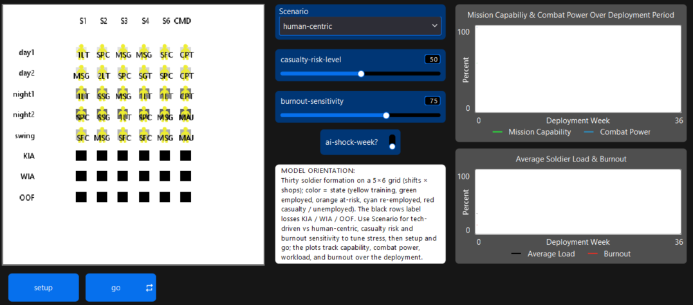
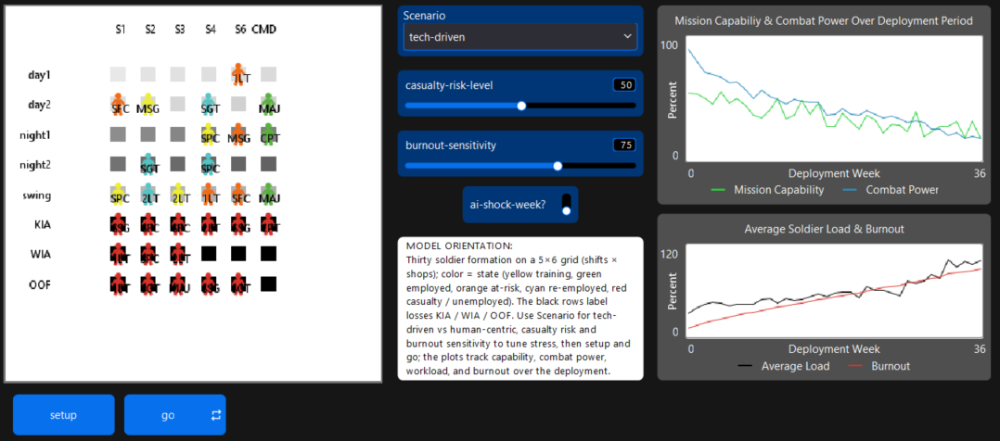
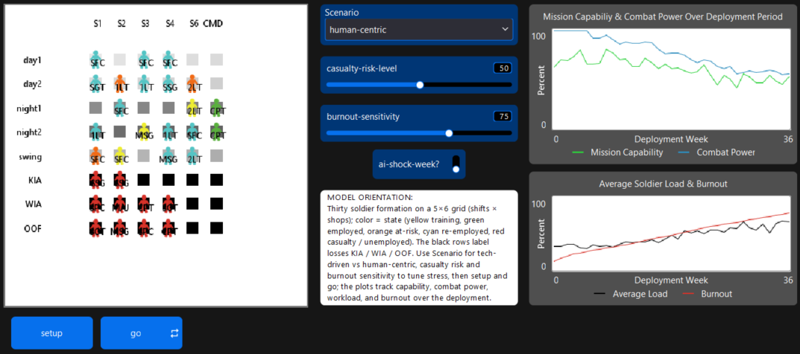

# Brigade Staff AI Workforce Odyssey — NetLogo ABM

Individual assignment (**Coding track**): agent-based simulation of workforce dynamics under AI-related pressure, using a **brigade staff (deployed)** metaphor—30 workers on a 5×6 grid (shifts × shops), with explicit states, probabilistic transitions, two scenarios, and system-level outputs.

**Author:** Ariana Rocha (afrocha)  
**Course:** Agentic Technologies — CO1: AI Workforce Odyssey  

---

## Requirements

- **NetLogo 7.x** (model saved as **NetLogo 7.0.3**). Download: [https://ccl.northwestern.edu/netlogo/download.shtml](https://ccl.northwestern.edu/netlogo/download.shtml)  
- Use **NetLogo 7** (not 6.4) to open **`.nlogox`** files. If your build only accepts `.nlogo`, use **File → Save As** inside NetLogo after opening, or copy the Code tab into a new NetLogo 7 model.

---

## Main model file

| File | Description |
|------|-------------|
| **`BrigadeStaff_AI_Workforce_Odyssey.nlogox`** | **Primary model** — full Interface (world, plots, scenario chooser, optional sliders). Open this in NetLogo 7. |

---

## How to run

1. Install **NetLogo 7** and launch the application.  
2. **File → Open** → select `BrigadeStaff_AI_Workforce_Odyssey.nlogox`.  
3. On the **Interface** tab, choose **Scenario**: `tech-driven` or `human-centric`.  
4. Click **`setup`**, then **`go`** (or run once per tick).  
5. The run stops after **36** deployment weeks (ticks), or stop manually.  

Optional Interface controls (if present): **casualty-risk-level**, **burnout-sensitivity**, **ai-shock-week?** — tune environment stress; see memo for interpretation.

---

## What the simulation includes (assignment alignment)

- **~30 agents** (`soldiers`), one labor market / deployment.  
- **States:** in-training, employed, at-risk, re-employed, unemployed (casualty).  
- **Transitions:** timed training completion, probabilistic employed→at-risk, at-risk→training, contact-style casualty, plus load/burnout updates.  
- **Two scenarios:** Tech-Driven Automation vs Human-Centric Support (globals set in `apply-scenario-presets`).  
- **Outputs (≥3):** e.g. mission capability, combat power, average soldier load, burnout rate (plots); unemployment / casualty visible on the world.  

For full design narrative, scenario comparison, and AI-use documentation, see **`WriteUp.tex`** (and your compiled PDF output).

---

## Repository layout (current)

```
├── BrigadeStaff_AI_Workforce_Odyssey.nlogox   # main NetLogo 7 model
├── WriteUp.tex                                 # short memo source (LaTeX)
├── AGAI_HW1_IndividualAssignment.pdf           # compiled memo (submission-ready PDF)
├── model_snip0.png                             # figure: Pre-run screenshot
├── model_snip1.png                             # figure: Tech-Driven run screenshot
├── model_snip2.png                             # figure: Human-Centric run screenshot
└── README.md                                   # project overview and run instructions
```

## Images

### Pre-run baseline


### Tech-Driven run


### Human-Centric run


---

## Citation / academic use

Coursework for **Agentic Technologies**. If you fork or reuse, retain attribution and your instructor’s reuse policy. 

AI Support Used: Cursor & ChatGPT

---

## License

All rights reserved unless your course specifies otherwise. Model is submitted as part of an individual academic assignment.
